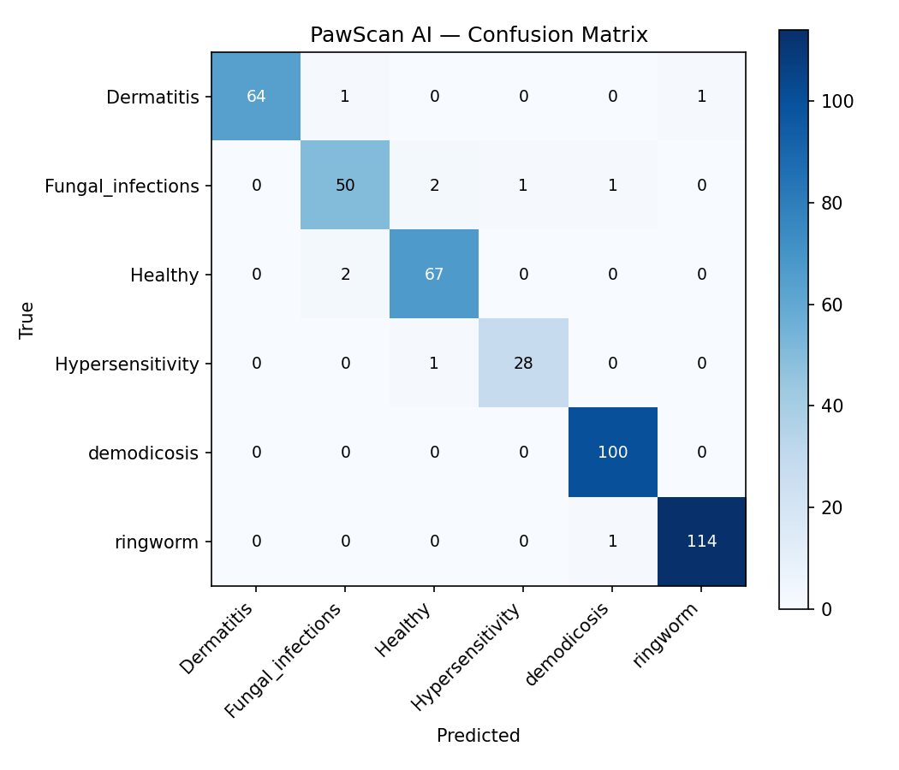

# 🐾 PawScan AI

**AI-Powered Pet Health Assessment Platform**

Upload a photo of your pet → Get instant AI disease detection, health score, and care recommendations.

Built as a project for the Pawbud Health AI Engineering Intern interview.

---

## 🔗 Live Demo
<!-- Add your Streamlit Cloud URL here after deployment -->
**[Try PawScan AI →](https://pawscan-ai-c97uemqj6c23f5jvvppavl.streamlit.app/)**

---

## 📋 What It Does

1. **Disease Detection** — An EfficientNet-B0 model analyzes pet photos for 6 skin conditions
2. **Health Score** — A 0-100 score combining AI prediction + symptoms + pet metadata
3. **Care Plan** — AI-generated recommendations (next steps, home care, what to watch for)
4. **Scan History** — Track health over time with a trend chart

## 🎯 Detected Conditions

| Condition | Severity | Contagious to Humans? |
|-----------|----------|----------------------|
| Healthy | None | No |
| Hypersensitivity | Mild | No |
| Dermatitis | Moderate | No |
| Fungal Infection | Moderate | Yes |
| Demodicosis | Severe | No |
| Ringworm | Severe | Yes |

## 🏗️ Architecture

```text
┌──────────┐     ┌──────────────┐     ┌───────────────────┐
│ Pet Photo │────▶│ Preprocessing │────▶│ EfficientNet-B0   │
│ Upload    │     │ (Resize 224,  │     │ 6-class classifier │
│ (JPG/PNG) │     │  Normalize)   │     │ Transfer Learning  │
└──────────┘     └──────────────┘     └────────┬──────────┘
                                              │
                     ┌────────────────────────┴──────────────┐
                     │        Grad-CAM Explainability          │
                     │  (heatmap of WHERE the model looked)    │
                     └────────────────────────┬──────────────┘
                                              ▼
┌──────────┐                    ┌──────────────────────────┐
│ User Meta │──────────────────▶│    Health Score Engine    │
│ (weight,  │                    │  Weighted: 60% + 20% + 20%│
│  age,     │                    │  Output: 0-100 score      │
│ symptoms) │                    └────────┬─────────────────┘
└──────────┘                             │
                                         ▼
                            ┌──────────────────────────────┐
                            │   LLM Care Recommendations   │
                            │   (Groq Llama 3.3 70B)       │
                            │   - Triage summary           │
                            │   - Next steps               │
                            │   - Home care tips           │
                            └──────────────────────────────┘
                                         │
                                         ▼
                            ┌──────────────────────────────┐
                            │     Streamlit Web App        │
                            │  - Health score gauge        │
                            │  - Probability bar chart     │
                            │  - Grad-CAM heatmap overlay  │
                            │  - Care plan display         │
                            │  - Scan history + trend      │
                            │    (session-scoped, private) │
                            └──────────────────────────────┘
```

## 📊 Model Performance

- **Architecture:** EfficientNet-B0 (ImageNet-pretrained, fine-tuned) with a
  Dropout→512→ReLU→Dropout→6-class head
- **Dataset:** ~4,315 labeled pet skin-disease images (6 classes),
  [Dog's skin diseases (Kaggle)](https://www.kaggle.com/datasets/youssefmohmmed/dogs-skin-diseases-image-dataset)
- **Training:** up to 20 epochs on a Kaggle T4 GPU — AdamW (initial LR 1e-4,
  cosine-decayed, weight decay 1e-4); best checkpoint selected at epoch 15
- **Validation accuracy:** **96.63%** (stored in the released checkpoint)

**Held-out test evaluation** (433 images from the dataset's `test` split — never
used for training or checkpoint selection; computed with `src/evaluate.py`):

| Metric | Value |
|---|---|
| Overall accuracy | **97.69%** |
| Macro-F1 (unweighted) | **97.17%** |
| Weighted-F1 | 97.69% |

| Class | Precision | Recall | F1 | Support |
|---|---|---|---|---|
| Dermatitis | 100.0% | 97.0% | 98.5% | 66 |
| Fungal_infections | 94.3% | 92.6% | 93.5% | 54 |
| Healthy | 95.7% | 97.1% | 96.4% | 69 |
| Hypersensitivity | 96.6% | 96.6% | 96.6% | 29 |
| demodicosis | 98.0% | 100.0% | 99.0% | 100 |
| ringworm | 99.1% | 99.1% | 99.1% | 115 |



Top confusions: Healthy ↔ Fungal_infections (2 images each way),
ringworm → demodicosis (1). The weakest class is Fungal_infections (F1 93.5%) —
the most clinically ambiguous category.

Reproduce with:

```bash
python src/evaluate.py --data-dir /path/to/dataset --split test --out results/
```

**Remaining honest caveats:** the split shipped with the dataset, so same-animal
photos may straddle train/test (dataset-level leakage can't be ruled out), and
all numbers come from a single dataset — no external validation. The app is
positioned as a preliminary assessment tool, not a diagnostic device.

## 🛠️ Tech Stack

| Component | Technology |
|-----------|------------|
| Disease Detection | PyTorch + EfficientNet-B0 (transfer learning) |
| Explainability | Grad-CAM (Selvaraju et al., 2017) on the final conv feature map |
| Health Score | Custom weighted scoring algorithm |
| LLM Care Plan | Groq Llama 3.3 70B (free API) |
| Web App | Streamlit |
| Deployment | Streamlit Community Cloud (free) |
| Model Training | Kaggle Notebooks (free T4 GPU) |

## Explainability — Grad-CAM

"Black box, trust me" is the #1 objection to any health-related CV model, so every
scan ships with a Grad-CAM heatmap showing exactly which regions of the photo
drove the prediction:

- **What it is:** the gradient of the predicted class score, global-average-pooled
  over channels, combined with the final convolutional feature map (7×7×1280 for
  a 224×224 input), ReLU'd, normalized and upscaled to the photo resolution.
- **Where you see it:** under the photo on the results page, in scan history views,
  and as a dedicated section in the downloadable HTML report.
- **Why it matters:** if the model highlights the lesion, the prediction is
  trustworthy; if it highlights fur or background, the user knows to treat the
  result with skepticism. This turns the model's failure modes into visible,
  actionable information for the pet parent.

## Scaling & Privacy

**The problem this project fixed:** the first version stored every scan — pet
photos (embedded as base64), names, weights, symptoms and results — in a single
`scan_history.json` written to the server's disk. On a shared deployment every
visitor read from and wrote to that *same* file, meaning:

1. **Cross-user data leak** — anyone opening "Scan History" saw every other
   user's pet photos and medical details.
2. **Corruption risk** — concurrent writes from simultaneous sessions could
   clobber or truncate the file.

**Current design:** scan history is stored in `st.session_state` — per browser
session, in memory only. Each user's data is fully isolated and nothing touches
the server's disk. Session-scoped was chosen deliberately for a public demo:
health data should be ephemeral by default.

**How it would scale to real multi-user use:**

- Add authentication (e.g. Streamlit Authenticator / Auth0 / Google OAuth)
- Persist each user's history to a database keyed by user ID (Postgres + an ORM,
  or Supabase/Firestore for a managed option)
- Store images in object storage (S3) with per-user prefixes and signed URLs,
  encrypted at rest
- Add a consent flow and retention policy (auto-delete scans after N days), since
  pet photos + health data are personal data under most privacy frameworks
  (India's DPDP Act, GDPR)
- Model serving would move from in-process PyTorch to a dedicated inference
  service (TorchServe / a FastAPI + GPU container) so the Streamlit frontend
  scales independently


## ⚠️ Disclaimer

This tool is for informational purposes only and is **not a substitute for professional veterinary diagnosis**. Always consult a licensed veterinarian for health concerns about your pet.

---

Built with ❤️ for pet health | PawScan AI
